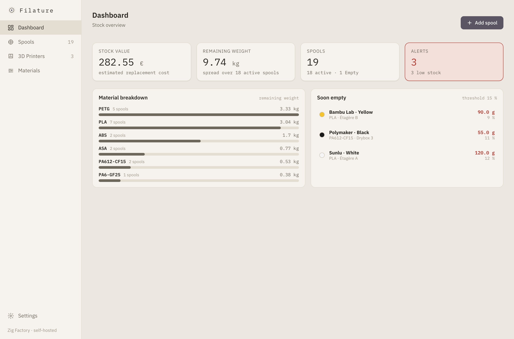

# Filature

Self-hosted filament stock management for 3D-printing workshops.

[](LICENSE)
[](https://www.rust-lang.org/)



## What is Filature?

Filature is a calm, practical inventory for every filament spool in your workshop. It tracks remaining weight and length, value, materials, storage locations, and printer loading from one self-hosted web interface. The application ships as a single Rust binary backed by PostgreSQL.

## Features

- Dashboard for stock value, remaining weight, material split, and low-stock alerts
- Filterable spool table and card views, inline weight editing, and a two-step add wizard
- Detailed spool identity, purchase data, remaining grams, metres, percentage, and weight gauge
- Editable material reference data for density, drying, humidity sensitivity, and print temperatures
- Storage locations and Bambu multi-AMS printer topology with per-slot spool loading
- Settings for stock thresholds, locale, and light/dark themes
- Portable full-instance export and import
- English and French interfaces with complete light/dark parity

## Quick start

```sh
git clone https://github.com/ziggornif/filature.git
cd filature
cp .env.example .env
# Set POSTGRES_PASSWORD in .env
docker compose run --rm app hash-password '<your-password>'
docker compose up -d --pull always
```

See the [full installation guide](https://ziggornif.github.io/filature/#installation), including the published-image and source-build paths.

## Security

Filature has a mandatory single-credential login gate and refuses to boot without an operator username and Argon2 password hash. It does not terminate TLS: put it behind an HTTPS reverse proxy and keep the application port private.

## Roadmap

- **Humidity monitoring:** SHT31 sensors over MQTT, per-material humidity thresholds, and “dry before you print” alerts.
- **Per-print consumption & cost:** grams used per job and real €/g part cost.
- **Spool entry via OCR:** scan a filament label to auto-fill the add form (brand, material, colour, weight).
- **More printer integrations:** support beyond Bambu AMS, plus Spoolman import.
- **Printers view UX:** refine the printers / AMS screen — clearer slot layout, faster spool loading, better at-a-glance state.
- **Live printer-API connection (exploratory, to be confirmed):** pull live print and loaded-spool information from Bambu, Prusa, or Klipper APIs instead of entering it manually.

## Contributing

Contributions are welcome. Read [CONTRIBUTING.md](CONTRIBUTING.md) to set up the project and understand its workflow.

## License

Filature is released under the [MIT License](LICENSE).
